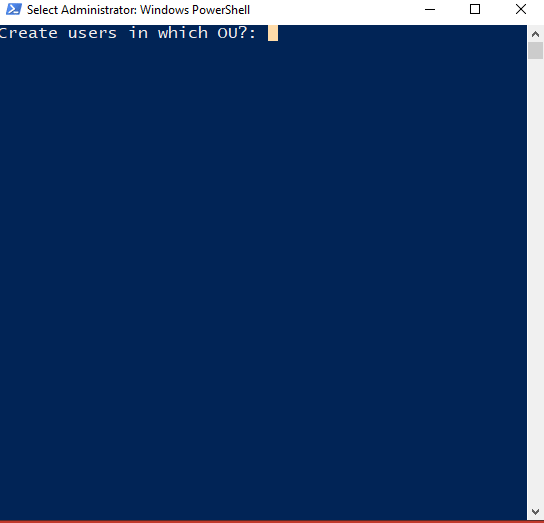
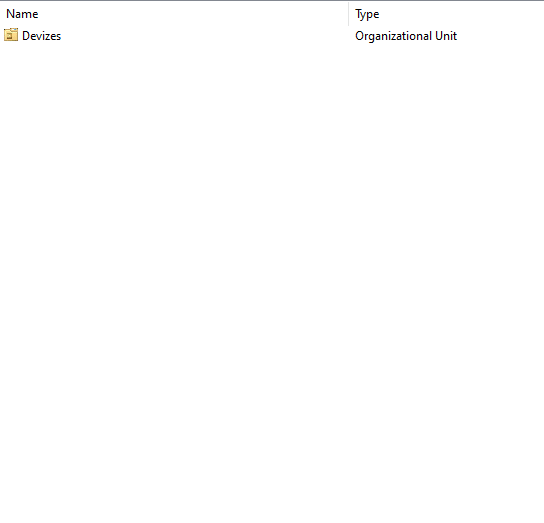

## The Script.

-->[Gist link](https://gist.github.com/wizardfree/ed81eb44e85c8303c5ff92904e8353a2) <--

```Powershell
$PASSWORD = "Password1"
$password = ConvertTo-SecureString $PASSWORD -AsPlainText -Force

$OU = Read-Host "Create users in which OU?"

$domain = Get-ADDomain -Current LoggedOnUser
$domainDist = $domain.DistinguishedName

Write-Host -ForegroundColor Green "Checking if OU exists in $domainDist"
$oucheck = [adsi]::Exists("LDAP://OU=$OU,$domainDist")
if ($oucheck -eq "True") {

    $text = "Adding to existing OU: $OU"
    Write-Host -ForegroundColor Green $text.ToUpper()

    $numOfUsers = Read-Host "How many users would you like to add to $OU ?"

    for ($u=1; $u -le $numOfUsers; $u++) {

        $response = Invoke-WebRequest -Uri 'https://randomuser.me/api/?nat=gb'

        $newUserData = $response | ConvertFrom-Json

        $first = $newUserData.results.name.first
        $last = $newUserData.results.name.last
        $username = "$($first)$($last.Substring(0,1))"

        Write-Host "Creating user: $($username)" -BackgroundColor Black -ForegroundColor White

        New-AdUser -AccountPassword $password `
               -GivenName $first `
               -Surname $last `
               -DisplayName "$($first) $($last)" `
               -Name "$($first) $($last)" `
               -EmployeeID $username `
               -SamAccountName $username `
               -UserPrincipalName "$($username)@$($domain.DNSRoot)" `
               -PasswordNeverExpires $true `
               -Path "OU=$OU,$domainDist" `
               -Enabled $true
    }

} else {

    $text = "$OU does not exist!"
    Write-Host -ForegroundColor Red $text.ToUpper()

}
```

## Screenshots.




## The why.
*Efficiency*

## The how.
> I'm not a real programmer. I throw together things until it works then I move on. The real programmers will say "Yeah it works but you're leaking memory everywhere. Perhaps we should fix that." I’ll just restart Apache every 10 requests. - [Rasmus Lerdorf](https://en.wikipedia.org/wiki/Rasmus_Lerdorf).

Using this [script](https://raw.githubusercontent.com/joshmadakor1/AD_PS/master/1_CREATE_USERS.ps1) from [Josh Makador](https://www.youtube.com/c/joshmadakor) as a starting point/inspiration.

The flow of the script is as follows:
1. Set the password to a known value for ALL (to be created) users.
2. Query which Organisational Unit (OU) the users will be placed into.
3. Grab the distinguished name for the domain automagically.
4. Determine if that OU exists, exiting if not.
5. Query how many users are required to be generated.
6. Use the [randomuser.me](https://randomuser.me) api to generate "random" users.
7. Extract the relevant information from the JSON response (First/Last name).
8. Generate a username from the provided first and last name. (In the format FirstL)
9. Create the user using the previous information.

## Conclusion.
This script is my first foray into Powershell scripting and combines a number of useful actions that are often used in the world of IT (User input, API calls, String Manipulation, System Calls, Objects).

The script is subject to change as new techniques and proficiencies come available to me, so watch the gist linked at the top of the page for the latest developments.