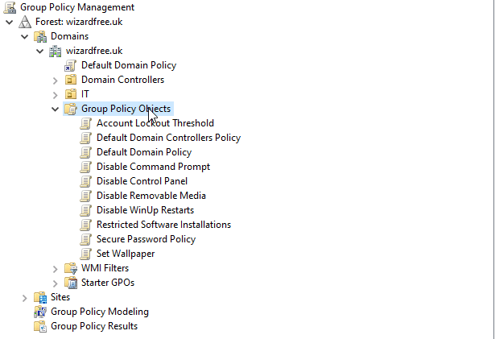
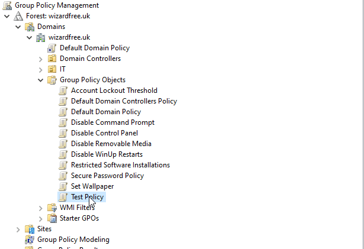
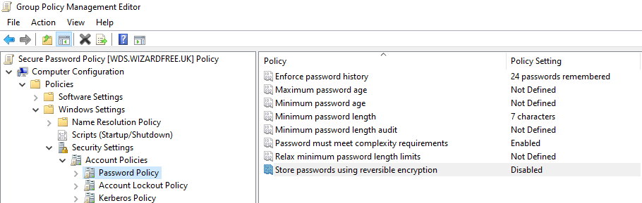
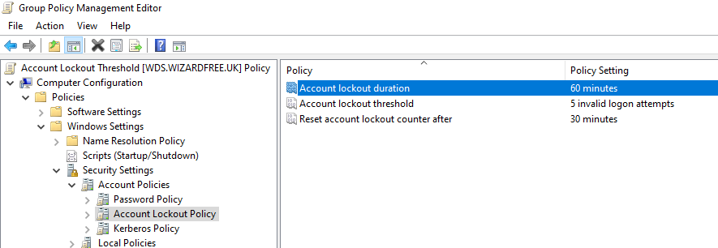
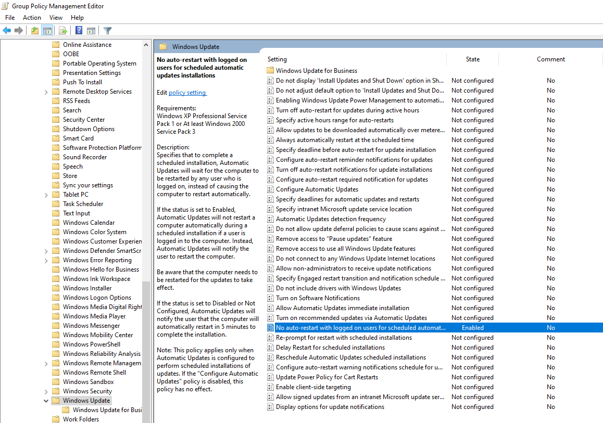
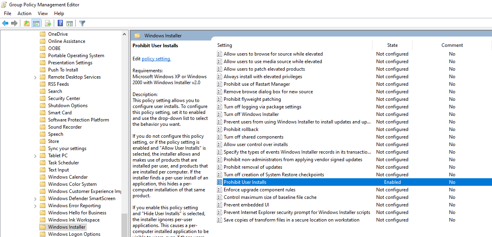
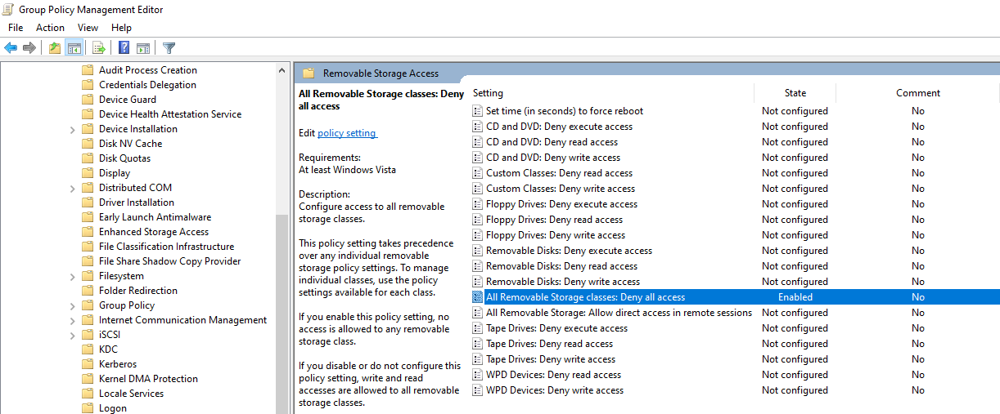
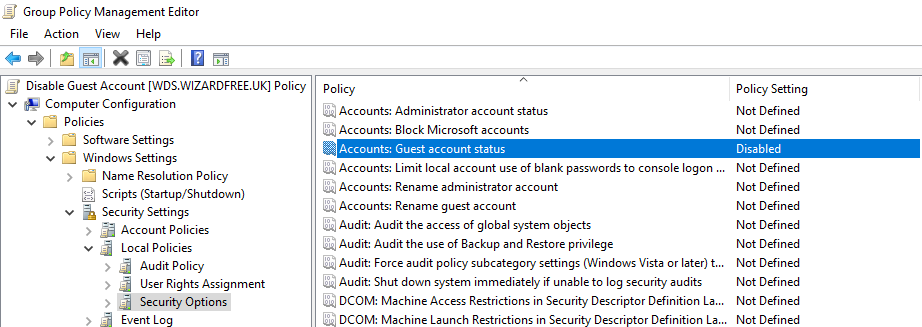
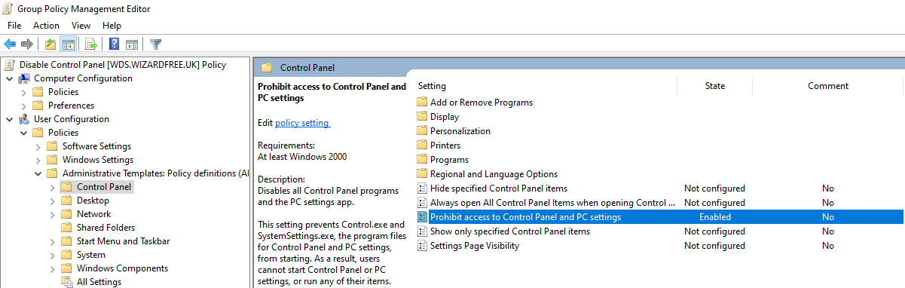
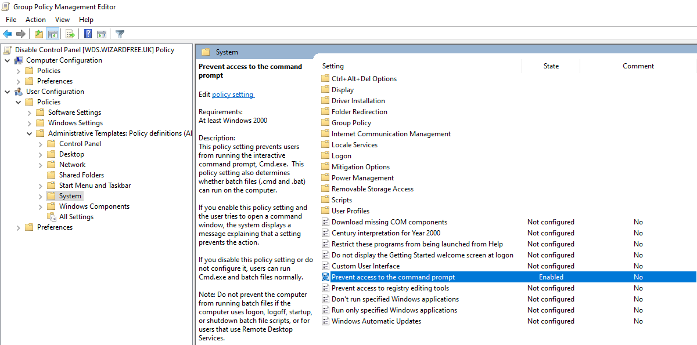

 
---
title: "Common Windows Group Policies"
date: 2022-04-01T15:31:31.204Z
description: "A selection of common/useful Group Policies for Windows."
draft: true
toc: true
author: Joseph Fleet
slug: windows.group.policies
tags:
- Windows
- Active Directory
---

Group Policies can be managed (at the domain level) with the Group Policy Management MMC (Microsoft Management Console) snap-in.

Server Manager ⇾ Tools ⇾ Group Policy Management
The following are a number of commonuseful GPOs (Group Policy Objects) which can help to manage Users and Windows Clients.
If looking for GPO best practices go [here](/404) instead.

---
For each policy we'll start from with the Group Policy Management snap-in under the domain, Group Policy Objects ⇾ Right-Click ⇾ New: [GPO Name]

Then under Group Policy Objects ⇾ Right-Click ⇾ Edit:

## **Password Policy**
Computer Configuration ⇾ Policies ⇾ Windows Settings ⇾ Security Settings ⇾ Account Policies ⇾ Password Policy

## **Account Lockout Policy**
Computer Configuration ⇾ Policies ⇾ Windows Settings ⇾ Security Settings ⇾ Account Policies ⇾ Account Lockout Policy

## **Disabled Windows Update Restarts**
Computer Configuration ⇾ Policies ⇾ Administrative Templates ⇾ Windows Component ⇾ Windows Update ⇾ Select: No auto-restart with logged on users for scheduled automatic updates installations

## **Prohibit User Software Install**
Computer Configuration ⇾ Policies ⇾ Administrative Templates ⇾ Windows Component ⇾ Windows Installer ⇾ Select: Prohibit User Install

## **Block All Removable Media**
User Configuration ⇾ Policies ⇾ Administrative Templates ⇾ System ⇾ Removable Storage Access ⇾ Select: All Removable Storage classes: Deny all access

## **Disable Guest Account**
Computer Configuration ⇾ Windows Settings ⇾ Security Settings ⇾ Local Policies ⇾ Security Options ⇾ Select: Accounts:Guest acount status

## **Disable Control Panel Access**
User Configuration ⇾ Policies ⇾ Administrative Templates ⇾ Control Panel ⇾ Select: Prohibit access to Control Panel and PC settings

## **Disable Command Prompt Access**
User Configuration ⇾ Policies ⇾ Administrative Templates ⇾ System ⇾ Select: Prevent access to the command prompt

