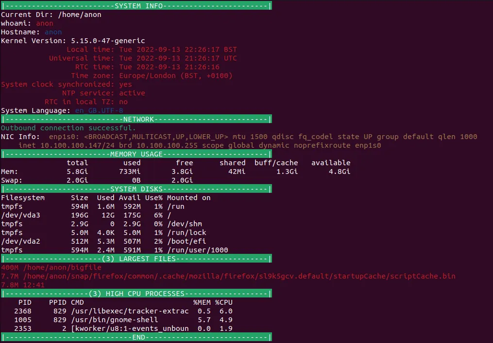

## [The Script.](https://gist.github.com/wizardfree/52ca731bbe1a97a8c1184b0a1ef95c7b)

At a glance, system information written in a bash shell script.

```bash
#!/usr/bin/env bash

###################################################################
# SCRIPT NAME       : infodump
# DESCRIPTION       : Script to output common useful information about a System Node.
# 
# AUTHOR            : Joseph S Fleet
# EMAIL             : josephsfleet@gmail.com
###################################################################

### Colour Definitions ###

RED='\033[0;31m'
GREEN='\033[0;32m'
YELLOW='\033[0;33m'
BLUE='\033[0;34m'
WHITE='\033[0;37m'
RESET='\033[0m'
BGGREEN='\033[42m'

##########################

clear

echo -e "${BGGREEN}|-------------------------SYSTEM INFO------------------------|${RESET}"

echo "Current Dir: $(pwd)"
echo -e "whoami: ${RED}$(whoami)${RESET}"
echo -e "Hostname: ${BLUE}$(uname -n)${RESET}"
echo -e "Kernel Version: $(uname -r)"
echo -e "${RED}$(timedatectl status)${RESET}"
echo -e "System Language: ${BLUE}$LANG${RESET}"

echo -e "${BGGREEN}|---------------------------NETWORK--------------------------|${RESET}"

if ping -c 1 1.1.1.1 &> /dev/null
then
    echo -e "${GREEN}Outbound connection successful.${RESET}"
else
    echo -e "${RED}Outbound connection ERROR.${RESET}" 
fi
echo -e "NIC Info: ${YELLOW}$(ip a | grep "eno\|enp" | cut -d ':' -f 2-3)${RESET}"

echo -e "${BGGREEN}|------------------------MEMORY USAGE------------------------|${RESET}"

echo -e "$(free -h)"

echo -e "${BGGREEN}|------------------------SYSTEM DISKS------------------------|${RESET}"

df -h

echo -e "${BGGREEN}|----------------------(3) LARGEST FILES---------------------|${RESET}"

echo -e "${RED}$(find /home -type f -printf '%s %p\n' 2> /dev/null | sort -nr | head -3 | xargs ls -lh 2> /dev/null | cut -d ' ' -f 5,9)${RESET}"

echo -e "${BGGREEN}|-------------------(3) HIGH CPU PROCESSES-------------------|${RESET}"

ps -eo pid,ppid,cmd,%mem,%cpu --sort=-%cpu | head -4

echo -e "${BGGREEN}|-----------------------------END----------------------------|${RESET}"
```

## Screenshots.


## The why.
```bash {linenos=table}
➜ whoami
user

➜ pwd              
/home/user

➜ ip a
<output omittted>

➜ echo "repeat ad nauseam"
```
How many times upon accessing a system have the same few commands been run to assess what exactly you're working with. To help alleviate this issue, the infodump script was born.

## The how.
Honestly there's nothing fancy going on here, using only built-in commands (Ubuntu 22.04.1 used for package reference), the script will run through common commands outputting to the terminal window.

Commands included (in order of appearance):
1. `clear`
2. `pwd`
3. `whoami`
4. `uname -n`
5. `uname -r`
6. `timedatectl status`
7. `echo $LANG`
8. `ping`
9. `ip a`
10. `free`
11. `dh -h`
12. `find`
13. `ps`
+ misc commands for formatting (`cut`, `grep`, `head`, `sort`, and `xargs`)

### FAQ
#### Why `timedatectl`?
The original version had in place of `timedatectl` a `ntpdate -q` command call to poll [pool.ntp.org](https://pool.ntp.org) to independently ascertain the current time according to NTP servers remotely. However, during testing on an Ubuntu 22.04.1 VM, the `ntpdate` package was not installed [^1]. To keep the script as "vanilla" as possible, the `timedatectl`[^2] command was selected.
#### The network connectivity test isn't very comprehensive, you know...
`ping` is a great network diagnostic tool but falls at many hurdles (ICMP packet rejection, bad routes, no remote connectivity etc) because of this typically if there is an issue with remote connectivity on a node then a `ping` failure indicates there is an issue which prompts a technician to delve deeper into the issue.

All that the network connectivity test in this script is doing is ascertaining at a glance whether remote connections can be made, the rest is up to whomever is using the script, in this sense the data is presented how it is. Presumptions/conclusions about the data is down to the context in which the script is used.
#### Why `free`?
The core of the script is "at a glance system info" `free` does this well, displaying combined system memory with basic usage.
#### The script hangs
This is down to the `find` command searching the home directory of the system. Depending on the number of files and the speed of the block device being accessed, this could take a few seconds to a few minutes, worth it in my opinion to see any particularly egregious files within the /home directory.
##### Why /home and not /?
If the script hanging for a few seconds to a minute scanning the home directory rustles your jimmies, scanning the **entire** drive would only serve to exasperate the issue[^3].

## Conclusion.
Only briefly touching my toes to the sea of Shell Scripting, it is already clear the immense power that could be wielded. Repeated tasks and systems maintenance (given time) could be written into Shell Scripts, solving much more [time](https://xkcd.com/1205/) later on.

An incredibly useful tool to have in one's tool belt for thinking sand. Watch this space for future scripts and other projects.

[^1]: For posterity according to the [Ubuntu Package Repository](https://packages.ubuntu.com/) the `ntpdate` package has been flagged as [deprecated](https://packages.ubuntu.com/search?keywords=ntpdate#:~:text=focal%20(20.04LTS)%20(net)%3A%20client%20for%20setting%20system%20time%20from%20NTP%20servers%20(deprecated)%20%5Buniverse%5D) since focal (20.04LTS) with the `ntpsec-ntpdate` package being the more current.

[^2]: An argument could be made that using the `timedatectl` command is not the most "vanilla" offering due to only being available on systems using the `systemd` service manager, however due to `systemd`'s prevalence in modern Linux Operating Systems the inclusion seems justified.

[^3]: A case could be made for the longer scan as an excuse to make a cup of coffee [(Same energy)](https://xkcd.com/303/).