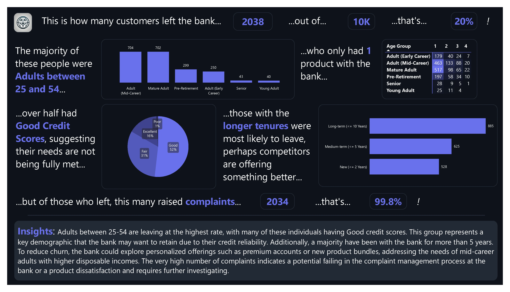

## Project Overview:

In this project, I developed a comprehensive data analysis report investigating customer churn for a fictitious multinational bank. 

The analysis focuses on identifying key factors contributing to customer attrition and provides actionable insights for improving retention and customer satisfaction. 

The report was created using Power BI, leveraging a variety of data visualization techniques to present complex information in an accessible format.

### Objectives:

**Identify Customer Churn Factors:** Analyze demographic, product ownership, and credit score data to determine key characteristics of customers who have left the bank.

**Investigate Customer Complaints:** Evaluate the relationship between customer churn and the number of complaints raised to uncover potential service-related issues.

**Provide Actionable Insights:** Offer tailored recommendations for reducing churn, including strategies for retaining key customer segments based on their tenure, creditworthiness, and product engagement.

### Key Insights:

**Age and Credit Scores:** The majority of customers who left the bank were adults between the ages of 25 and 54, many of whom had good or excellent credit scores. 

This suggests that despite their credit reliability, their needs may not be fully met by the bank’s current offerings.

**Tenure Impact:** Customers with longer tenures (over 5 years) were more likely to leave, indicating potential fatigue with the bank’s product offerings or the presence of better alternatives from competitors.

**Complaints and Dissatisfaction:** A significant proportion of those who left the bank had raised complaints, with many reporting dissatisfaction in the complaint resolution process. This highlights a potential failure in customer service management.

### Recommendations:

**Targeted Retention Strategies:** Develop personalized product bundles and loyalty programs tailored to mid-career adults (aged 25-54) with good credit scores, who represent a valuable demographic for the bank.

**Customer Satisfaction Improvements:** Revamp the complaint resolution process to improve customer satisfaction, as dissatisfaction is strongly linked to higher churn rates.

**Product Engagement Programs:** Offer new product promotions and cross-selling opportunities to long-tenured customers to keep them engaged and reduce the likelihood of attrition.

### Tools Used:

**Power BI:** Used to create dynamic visuals, charts, and dashboards for an interactive and visually appealing report.

**Data Analysis:** Applied advanced filtering and data modeling techniques to uncover trends and patterns in customer behavior and complaints.

### Data Used:

[This Kaggle dataset.](https://www.kaggle.com/datasets/radheshyamkollipara/bank-customer-churn) Thanks to _Radheshyam Kollipara_ for uploading.

#### Data Sample

```bash
head -n 5 Customer-Churn-Records.csv
```

|RowNumber|CustomerId|Surname |CreditScore|Geography|Gender|Age|Tenure|Balance |NumOfProducts|HasCrCard|IsActiveMember|EstimatedSalary|Exited|Complain|Satisfaction Score|Card Type|Point Earned|
|---------|----------|--------|-----------|---------|------|---|------|--------|-------------|---------|--------------|---------------|------|--------|------------------|---------|------------|
|1        |15634602  |Hargrave|619        |France   |Female|42 |2     |0       |1            |1        |1             |101348.88      |1     |1       |2                 |DIAMOND  |464         |
|2        |15647311  |Hill    |608        |Spain    |Female|41 |1     |83807.86|1            |0        |1             |112542.58      |0     |1       |3                 |DIAMOND  |456         |
|3        |15619304  |Onio    |502        |France   |Female|42 |8     |159660.8|3            |1        |0             |113931.57      |1     |1       |3                 |DIAMOND  |377         |
|4        |15701354  |Boni    |699        |France   |Female|39 |1     |0       |2            |0        |0             |93826.63       |0     |0       |5                 |GOLD     |350         |

### Outcome:

The report provides the (fictious) bank with clear insights into why customers are leaving and offers practical solutions to reduce churn. By focusing on improving customer satisfaction and offering tailored products to high-value customers. The bank can potentially reduce churn rates and improve overall customer retention.

### Power Query

```m
let
    Source = Csv.Document(File.Contents("Z:\Customer-Churn-Records.csv"),[Delimiter=",", Columns=18, Encoding=1252, QuoteStyle=QuoteStyle.None]),
    #"Promoted Headers" = Table.PromoteHeaders(Source, [PromoteAllScalars=true]),
    #"Changed Type" = Table.TransformColumnTypes(#"Promoted Headers",{{"RowNumber", Int64.Type}, {"CustomerId", Int64.Type}, {"Surname", type text}, {"CreditScore", Int64.Type}, {"Geography", type text}, {"Gender", type text}, {"Age", Int64.Type}, {"Tenure", Int64.Type}, {"Balance", type number}, {"NumOfProducts", Int64.Type}, {"HasCrCard", Int64.Type}, {"IsActiveMember", Int64.Type}, {"EstimatedSalary", type number}, {"Exited", Int64.Type}, {"Complain", Int64.Type}, {"Satisfaction Score", Int64.Type}, {"Card Type", type text}, {"Point Earned", Int64.Type}}),
    #"Renamed Columns" = Table.RenameColumns(#"Changed Type",{{"CreditScore", "Credit Score"}, {"NumOfProducts", "Number of Products"}, {"HasCrCard", "Has Credit Card"}, {"EstimatedSalary", "Estimated Salary"}}),
    #"Changed Type1" = Table.TransformColumnTypes(#"Renamed Columns",{{"Exited", type logical}, {"Complain", type logical}, {"IsActiveMember", type logical}, {"Has Credit Card", type logical}})
in
    #"Changed Type1"
```

### DAX

#### Columns

```dax

Tenure Group = 
SWITCH(
    TRUE(),
    [Tenure] <= 2, "New (<= 2 Years)",
    [Tenure] <= 5, "Medium-term (<= 5 Years)",
    [Tenure] <= 10, "Long-term (<= 10 Years)",
    "Very Long-term"
)

Credit Score Group = 
SWITCH(
    TRUE(),
    [Credit Score] < 400, "Poor",
    [Credit Score] >= 400 && [Credit Score] < 600, "Fair",
    [Credit Score] >= 600 && [Credit Score] < 750, "Good",
    [Credit Score] >= 750, "Excellent"
)

Age Group = 
SWITCH(
    TRUE(),
    [Age] <= 14, "Child",
    [Age] >= 15 && [Age] <= 24, "Young Adult",
    [Age] >= 25 && [Age] <= 34, "Adult (Early Career)",
    [Age] >= 35 && [Age] <= 44, "Adult (Mid-Career)",
    [Age] >= 45 && [Age] <= 54, "Mature Adult",
    [Age] >= 55 && [Age] <= 64, "Pre-Retirement",
    [Age] >= 65, "Senior"
)

Satisfaction Score Group = 
SWITCH(
    TRUE(),
    [Satisfaction Score] = 1, "Very Dissatisfied",
    [Satisfaction Score] = 2, "Dissatisfied",
    [Satisfaction Score] = 3, "Neutral",
    [Satisfaction Score] = 4, "Satisfied",
    [Satisfaction Score] = 5, "Very Satisfied"
)
```

#### Measures

```dax
% Complained = 
    [Count of Exit Complaints] / [Count of Exited] // Formatted as Percentage

% Exited = 
    [Count of Exited] / [Total Customers] // Formatted as Percentage

Count of Exit Complaints =
CALCULATE (
    COUNTA ( 'Customer-Churn-Records'[Exited] ),
    'Customer-Churn-Records'[Complain] = TRUE
        && 'Customer-Churn-Records'[Exited] = TRUE
)

Count of Exited = 
CALCULATE (
    COUNTA ( 'Customer-Churn-Records'[Exited] ),
    'Customer-Churn-Records'[Exited] = TRUE
)

Total Customers = 
    COUNT('Customer-Churn-Records'[RowNumber])
```