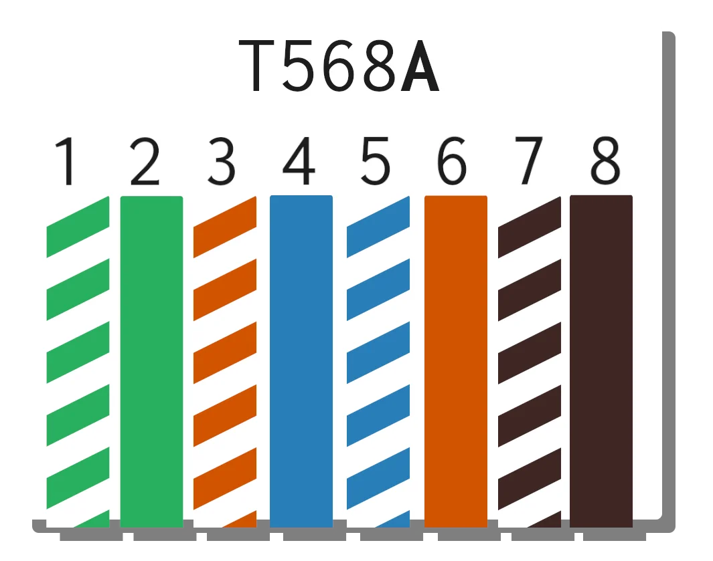
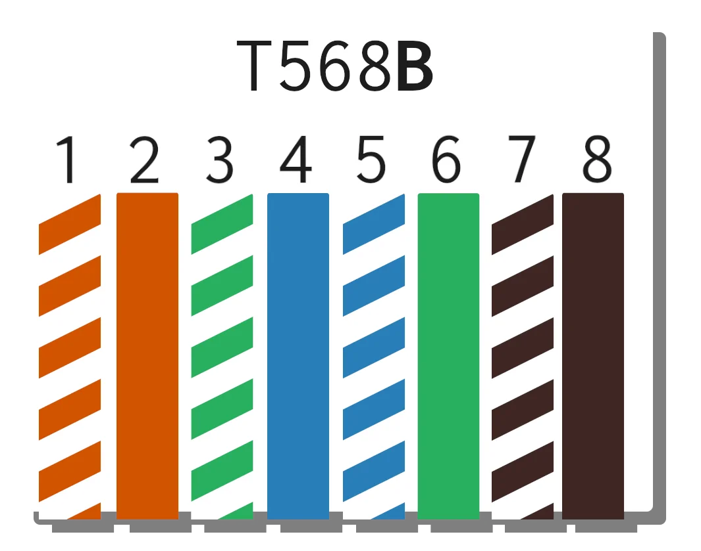

Introduced by [Alexander Gramham Bell](https://worldwide.espacenet.com/patent/search/family/002313755/publication/US244426A?q=pn%3DUS244426A) back in the late 1800s. To solve the issue of interference on the phone lines.

Twisted-pair cabling has come a long way since then. Modern advancements have led to speeds of [40 Gigabits](https://www.cablinginstall.com/cable/article/14037071/rm-reichle-demassari-ag-cat-81-cabling-system-delivers-up-to-40-gbe-for-lans-data-centers#:~:text=supports%20the%20fastest%20data%20transmission%20for%20local%20networks%20that%20structured%20copper%20cabling%20can%20achieve%20today%3A%20namely%20up%20to%2040%20Gigabit/s%20Ethernet.) over 30 meters!

But what is twisted-pair!? No, it's not a film by [Neil Breen](https://www.imdb.com/title/tt8196068/). 

It is instead the copper backbone of most LANs and offices worldwide. You most likely recognise it as an Ethernet cable. That thing with the funny connector that goes into the back of a device to wire it to the interwebs.

Ethernet cabling from the outside all looks the same but on the inside it can be very different[^1]. 

There exist multiple categories of Ethernet cabling. Each category being an improvement on the last. 

Commonly seen today are **Cat5e** and **Cat6a**.

**Cat5e** runs comfortably at **100Mbps** but can reach **1Gbps** over shorter distances (**>10m**).

**Cat6a** can run **10Gbps** at **100m**. *Nice*.

---

There are two standards for twisted-pair. Both defined by the [Telecommunications Industry Association (TIA)](https://tiaonline.org/) and the [Electronic Industries Alliance (EIA)](https://en.wikipedia.org/wiki/Electronic_Industries_Alliance). The standards define 4 pairs of coloured internal wire to be used:
1. White/Blue, Blue
2. White/Green, Green
3. White/Orange, Orange
4. White/Brown, Brown

These 4 pairs are then used in either a **T568A** or **T568B** configuration.

### T568A

### T568B

When to use each standard?

In practice there are crossover and straight-through cables.

Crossover as the name suggests flips some of the wires so that one end 'talks' the other 'listens'. Wires 4, 5, 7, and 8 never change but wires 1, 3, 2 and 6 flip.

Straight-through keeps things simple and has both ends of the wire terminate to the same wires.

Modern switches are smart enough to configure themselves to however pins are configured (whether crossed or straight).

As for which standard to use honestly as long as a single one of the standards is adhered to it [doesn't matter](https://www.truecable.com/blogs/cable-academy/t568a-vs-t568b).

## Example
Shown below is the creation of a straight-through T568B cable.

Tools required:
- `Cutting tool` (wire cutters, sharp blade, or a pair of scissors will do)
- `Wire Strippers` (if you're careful this could be done with a blade)
- `8P8C connectors` (pictured below)
    - NOTE: different Cat ratings require different `8P8C connectors`.
    - Some connectors have a through design allowing the wires to poke all the way through (before crimping).
- `Crimping tool`

- Using a cutting tool to remove the outer plastic sheath.
    - You'll want to cut enough off the end to expose the wires to go into the connector and to account for trimming them flat.
- Seperate out the wire pairs. Untwist them as straight as you can manage.
- Align the wires into the correct colour pattern. (See above for reference)
- Optional: If the wires aren't all entirely flush with the ends of one-another. Trim them now.

Pictured below is the 4 pairs of wires. In the background you can see a fiberous cord used to help remove the outer sheath.

- Carefuly insert the wires as a single block into the connector. Ensuring the ends go all the way to the top.
- Happy with the order inside the block. Time to crimp.
- Plug the connector into the crimping tool. And squeeze down on the tool.
    - A satisfying clicking can be heard as the plastic compresses and bites into the copper wire within.

Notice the exposed wires on the underside of the connector. Don't do this. Please use a [connecting boot](https://m.media-amazon.com/images/I/61NLI4ZnIwL._SL1100_.webp).

For my fellow visual learners. Here is a great video resource by [Tek Syndicate](https://www.youtube.com/c/teksyndicate) showing the process step-by-step. [Here](https://youtube.com/v/lullzS740wI)

[^1]: There exists unshielded and shielded twisted cabling. You might see shielded cabling in environments with lots of electronics. This shielding is to prevent [crosstalk](https://en.wikipedia.org/wiki/Crosstalk).